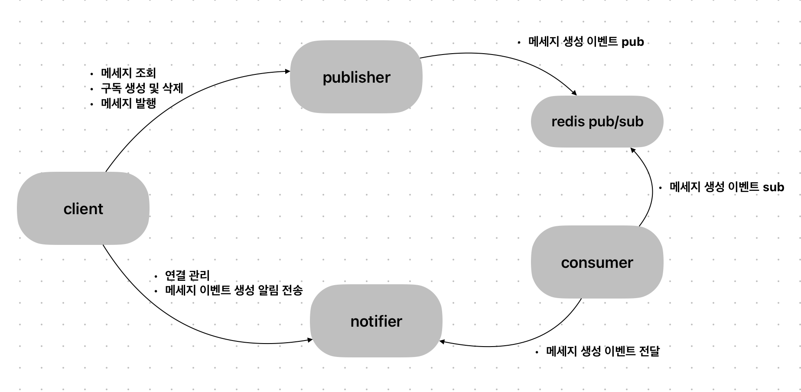

### 역활
* publisher
  * 메세지 조회
  * 클라이언트 구독 생성 관리
  * 메세지 생성 및 이벤트 생성
* notifier
  * 클라이언트 연결 관리
  * 서버 사이트 알림 전송
* consumer
  * 메세지 생성 이벤트를 notifier 전달

### 미구현 이슈
* redis pub/sub channel 이 하나이므로 consumer scale out 안됨 - redis 를 바꾸거나 자료구조를 List 변경
* notifier 연결된 클라이언트 종료시 구독 해지 미구현

### 구조


### 테스트
* docker compose 실행
  * mysql 준비 시간이 필요 하므로 상태 확인 후 테스트 (docker ps)
```bash
docker compose up -d --build
```
* 웹소켓 연결
```bash
wscat -c localhost:9001/api/v1/ws --slash
```
* 메세지 구독 생성
  * 웹소켓 연결을 하면 connectionID를 받는다 그 값을 아래 connectionID에 사용
```bash
http POST http://localhost:9002/api/v1/subscribes \
  topic=01GXZE2X4BMVE0G2H50KZ8REQD connectionID=01GYZ8RAHSE45A2JCVNVA6BTJ2
```
* 메세지 생성
```bash
http POST http://localhost:9002/api/v1/publish \
  topic=01GXZE2X4BMVE0G2H50KZ8REQD content="Hello Houston." sender="alice"
```

### 조회 테스트
```bash
http GET http://localhost:9002/api/v1/messages \
  lastID==01GY1AZN62M9PDQDWGYG3VW6DJ topic==01GXZE2X4BMVE0G2H50KZ8REQD limit==10 forward==true
  
http GET http://localhost:9002/api/v1/messages/01GY06XKXY3QAFCCAWKB5X9G06 \
  topic==01GXZE2X4BMVE0G2H50KZ8REQD

http POST http://localhost:9002/api/v1/publish \
  topic=01GXZE2X4BMVE0G2H50KZ8REQD content="Hello Houston." sender="alice"
```

### 구독 생성 삭제
```bash
http POST http://localhost:9002/api/v1/subscribes \
  topic=01GXZE2X4BMVE0G2H50KZ8REQD connectionID=01GYZ8RAHSE45A2JCVNVA6BTJ2
  
http DELETE http://localhost:9002/api/v1/subscribes \
  topic=01GXZE2X4BMVE0G2H50KZ8REQD connectionID=01GY1AZN62M9PDQDWGYG3VW6DJ

http DELETE http://localhost:9002/api/v1/subscribes \
  connectionID=01GY1AZN62M9PDQDWGYG3VW6DJ  
```

### consumer 이벤트 발생
```bash
docker run --rm redis \
  redis-cli -h host.docker.internal -p 6379 publish forwarder-channel "{\"connectionID\" : \"01GYSXHBJC5VQV6RENWY0JCD21\", \"payload\": \"Hello Houston\"}"
```

### 메세지 생성 및 조회
```bash
http POST http://localhost:9002/api/v1/messages topic=01GXZE2X4BMVE0G2H50KZ8REQD content="Hello Houston." author="alice" \
    | jq -r '.id' \
    | xargs -I {} http GET http://localhost:9002/api/v1/messages/{} topic==01GXZE2X4BMVE0G2H50KZ8REQD
```
